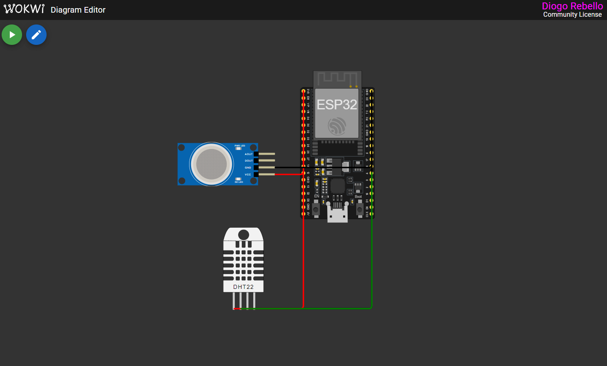
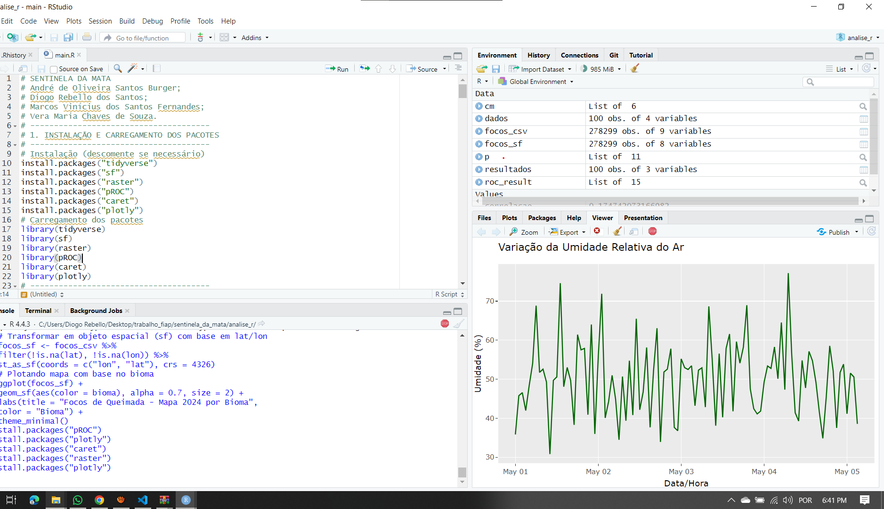

# 🔥 Sentinela da Mata - Sistema de Prevenção a Queimadas 🌿

Projeto acadêmico desenvolvido na FIAP com foco em prevenção a incêndios florestais utilizando IoT, Machine Learning e alertas automatizados via e-mail.

---

## 📦 Estrutura do Projeto

```
sentinela_da_mata/
├── sensores/
│   └── main.ino
│
├── api/
│   ├── app.py # API Flask principal
│   ├── treinar_modelo.py # Treinamento do modelo de risco
│   ├── modelo_risco_queimada.pkl # Modelo Treinado
│   └── requirements.txt # Dependências do projeto
│
├── analise_r/
│   ├── main.R # Script em R
│   └── global_solution.Rproj # Projeto em R
│
├── .gitignore
└── README.md
```

### ▶️ Vídeo de Evidência do Funcionamento do Projeto.

[https://youtu.be/lDRflYVqzes](https://youtu.be/lDRflYVqzes)


## 🌡️ Fase 1 - ESP32 com Sensores Ambientais



O circuito foi simulado na plataforma [Wokwi](https://wokwi.com/) com os seguintes componentes:

- ✅ **ESP32 DevKit v1**
- 🌡️ **Sensor DHT22** (temperatura e umidade)
- 💨 **Sensor MQ-2** (simulando nível de fumaça)

### 🔄 Comportamento:

- A cada 5 segundos, o ESP32 lê os valores dos sensores e envia via `HTTP POST` para a API.
- Os dados só são enviados se o endpoint `/status-irrigacao` retornar que é permitido (baseado na previsão do tempo).

---

## 🧠 Fase 2 - API Flask com MySQL e Alertas

A API realiza:

- 🔎 Recebimento de leituras do ESP32 (`/leituras`)
- 📊 Classificação de risco (`baixo`, `moderado`, `alto`)
- 📤 Envio de alertas por e-mail para destinatários cadastrados
- 📁 Armazenamento de todas as leituras e alertas no banco de dados

### ▶️ Como Executar

```bash
cd api
pip install -r requirements.txt
python app.py
```

### 🌐 Swagger

Acesse a documentação da API:

👉 **http://{base_url_api}:5000/apidocs**

### 🗂️ Estrutura do Banco de Dados

O projeto utiliza um banco **MySQL** com as seguintes tabelas:

### 📋 Tabela: `leituras`

Armazena cada leitura capturada pelo ESP32:

| Campo         | Tipo        | Descrição                                      |
|---------------|-------------|------------------------------------------------|
| `id`          | INT (PK)    | Identificador da leitura                       |
| `temperatura` | FLOAT       | Temperatura ambiente capturada (°C)           |
| `umidade`     | FLOAT       | Umidade relativa do ar (%)                     |
| `fumaca`      | INT         | Valor bruto do sensor de fumaça (MQ-2)         |
| `risco`       | ENUM        | Classificação: `baixo`, `moderado`, `alto`    |
| `data_hora`   | DATETIME    | Timestamp da leitura (default: NOW)           |

### 🔥 Tabela: `alertas`

Registra alertas emitidos com base nas leituras de risco:

| Campo         | Tipo        | Descrição                                         |
|---------------|-------------|--------------------------------------------------|
| `id`          | INT (PK)    | Identificador do alerta                          |
| `leitura_id`  | INT (FK)    | Referência à leitura associada                   |
| `tipo`        | ENUM        | Tipo do alerta: `moderado` ou `alto`            |
| `mensagem`    | VARCHAR     | Mensagem enviada no alerta                       |
| `enviado`     | BOOLEAN     | Se o alerta foi enviado por e-mail (default: FALSE) |
| `data_alerta` | DATETIME    | Timestamp do alerta                              |

### 📬 Tabela: `destinatarios_alerta`

Define as pessoas que receberão os alertas:

| Campo        | Tipo        | Descrição                                |
|--------------|-------------|-------------------------------------------|
| `id`         | INT (PK)    | Identificador do destinatário             |
| `nome`       | VARCHAR     | Nome da pessoa                            |
| `email`      | VARCHAR     | Endereço de e-mail                        |
| `telefone`   | VARCHAR     | Telefone (para futuros envios por SMS)    |
| `send_email` | BOOLEAN     | Deseja receber alertas por e-mail?        |
| `send_sms`   | BOOLEAN     | Deseja receber alertas por SMS? (futuro)  |

---

## 🧠 Fase 3 - Machine Learning com Scikit-Learn

O script `treinar_modelo.py` treina um modelo de classificação de risco com base em dados históricos, usando:

- `temperatura`, `umidade`, `fumaca` → `risco`

O modelo `modelo_risco_queimada.pkl` é carregado pela API, mas **pode ser desativado** se preferir lógica por regras fixas.

### ▶️ Como Executar

```bash
cd api
pip install -r requirements.txt
python treinar_modelo.py
```
---

## 🌡️ Fase 4 - Anãlise dos Dados em R



Basta abrir no R Studio o projeto que está na pasta e executar o arquivo main.R.

---

## 📬 Envio de Alertas por E-mail

A cada leitura com risco `moderado` ou `alto`:

- A API verifica se **já existe alerta similar nos últimos 15 minutos**
- Se não houver, grava o alerta e dispara e-mails para os destinatários com `send_email = TRUE`

### 📥 Cadastro de destinatários

Via endpoint:

```http
POST /destinatarios
{
  "nome": "Fulano",
  "email": "fulano@dominio.com",
  "telefone": "11999999999",
  "send_email": true,
  "send_sms": false
}
```
---


## 🧑‍🤝‍🧑 Membros do Grupo

| Matrícula                 | Aluno               											  |
|---------------------------|---------------------------------------------|
|        RM 565150          | Andre de Oliveira Santos Burger							|
|        RM 565497          | Vera Maria Chaves de Souza									| 
|        RM 565286          | Diogo Rebello dos Santos										|
|        RM 565555          | Marcos Vinícius dos Santos Fernandes				|
